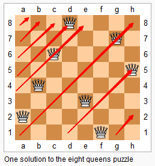
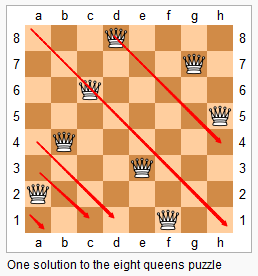
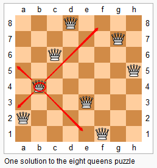

**题目描述**：  *n* 皇后问题研究的是如何将 *n* 个皇后放置在 *n*×*n* 的棋盘上，并且使皇后彼此之间不能相互攻击（棋子 **横、竖、斜**都可走一或 N-1 步，可进可退）。  给定一个整数 *n*，返回 *n* 皇后不同的解决方案的数量。 


**示例**

```
输入: 4
输出: 2
解释: 4 皇后问题存在如下两个不同的解法。
[
 [".Q..",  // 解法 1
  "...Q",
  "Q...",
  "..Q."],

 ["..Q.",  // 解法 2
  "Q...",
  "...Q",
  ".Q.."]
]
```

**解答**：**暴力回溯**

+ 由上图，**每一层都需要放置一个棋子，如果当前层成功放入一个棋子，则深入下一层棋子，直到最后一层。**

  由 8 皇后的规则可知，当前位置可放置棋子则说明：

  1. 当前 行、列 都未曾放入棋子，否则冲突
  2. 当前 位置 的斜向方向（反斜、正斜）都未曾放入棋子，否则冲突。

+ 因此，当前有两个任务：

  1. 判断当前位置是否可放置棋子**（需要复杂判断）**
  2. 深入下一层放置棋子**（递归实现）**

+ **题解**

  + *棋子位置状态保存结构*

    1. **解 1：二维数组**放置整个棋盘放置棋子（空间 *O(N^2)*）

    2. **解 2：两个数组**（压缩空间 *O(N)* ）：

       一个数组：每列是否已经放置棋子

       一个数组：某列已放置棋子的层数

    3. **解 3：一个数组**（再压缩空间 *O(N)* ）：

       数组的元素值表示 该下标表示的列 上放置棋子所在的层数

  + *棋子位置判断*

    + 横向判断：循环遍历横向 1~N 的位置，自然而然横向只会有一个棋子
    + 纵向判断：由上述的棋子保存结构可推断，当前列是否已经存放过棋子
    + 斜向判断：*根据当前的层数 与  当前的横向位置，得出两个斜向的关系，遍历两个斜向方向，判断斜向是否已经有棋子。（判断当前位置是否可放置棋子，需要一次 O(N) 的遍历）*

  + **题解 4：性能优化 —— 时间优化**

    + 上述解法 3，将空间压缩到 O(N)，但是，判断当前位置是否可放入棋子时，还需要 O(N) 的时间遍历判断。根据斜向方向的 横纵 坐标的关系，可以进一步优化！

    + **放置棋子时，该棋子会占用 斜向（正斜、反斜）两个方向上的位置，因此，可以根据斜向 横纵坐标 的关系，在斜向两个方向上做占用标记。**

      + *正斜* ：横纵坐标方向关系：**x + y 固定**

        

      + *反斜* ：横纵坐标方向关系：**x - y 固定**

        

    + 正斜、反斜 两个方向分别有 2\*N - 1 个值，因此，需要两个 2\*N 的数组，表示正斜、反斜两个方向

    + 一个位置会同时确定两个方向

      

    + 题解：**使用两个方向的数组做位置标记，能够在判断棋子是否可放置时，在 O(1) 的时间内判断出结果！**

  + **题解 5：性能优化 —— 空间优化**

    + 由分析可知，8 皇后问题需要暴力回溯，整体的时间复杂度 O(N^N) ，当 N = 10 时，需要 10 亿次遍历。

      因此，N 一定不会很大，不会超过 32，甚至不会超过 64。

      因此，可以使用 **整型值 + 位操作** 代替**三个方向数组（竖向、正斜向、反斜向）**的位置标记作用！

+ **解 2：两个数组**

  ```java
  class Solution {
      // 两个数组
      private int[] record;
      private int[] recordIdx;
      
      private int count;
      private int n;
      public int totalNQueens(int n) {
          this.record = new int[n];
          this.recordIdx = new int[n];
  
          this.count = 0;
          this.n = n;
          recursion(1);
          return count;
      }
      // 暴力回溯
      private void recursion(int idx){
          for(int i = 0; i < n; ++i){
              // 判断当前层的当前横向位置是否可放置棋子
              if(canPut(i, idx)){
                  if(idx == n){
                      this.count++;
                      return;
                  } 
                  record[i] = 1;
                  recordIdx[i] = idx;
                  
                  recursion(idx + 1);
  
                  recordIdx[i] = 0;
                  record[i] = 0;
              }
          }
      }
      // 判断第 idx 层的 第 i 个位置，是否可放置棋子
      private boolean canPut(int i, int idx){
          if(record[i] == 1){
              return false;
          }
          // 两个方向的循环遍历判断
          int tempI = i;
          while(--tempI >= 0){
              if(record[tempI] == 1 && Math.abs(recordIdx[tempI] - idx) == i - tempI){
                  return false;
              }
          }
          tempI = i;
          while(++tempI <= this.n - 1){
              if(record[tempI] == 1 && Math.abs(recordIdx[tempI] - idx) == tempI - i){
                  return false;
              }
          }
          return true;
      }
  
  }
  ```

+ **解 3：一个数组**

  ```java
  class Solution {
      // 一个数组：既保存第 i 列是否存入棋子，又保存该棋子是第 几层 的棋子。
      private int[] record;
      private int count;
      private int n;
      public int totalNQueens(int n) {
          this.record = new int[n];
          this.count = 0;
          this.n = n;
          recursion(1);
          return count;
      }
      // 暴力回溯
      private void recursion(int idx){
          for(int i = 0; i < n; ++i){
              // 判断当前层的当前横向位置是否可放置棋子
              if(canPut(i, idx)){
                  if(idx == n){
                      this.count++;
                      return;
                  } 
                  record[i] = idx;
                  recursion(idx + 1);
                  record[i] = 0;
              }
          }
      }
      // 判断第 idx 层的 第 i 个位置，是否可放置棋子
      private boolean canPut(int i, int idx){
          if(record[i] > 0){
              return false;
          }
          //  两个方向的循环遍历判断
          int tempI = i;
          while(--tempI >= 0){
              if(record[tempI] > 0 && Math.abs(record[tempI] - idx) == i - tempI){
                  return false;
              }
          }
          tempI = i;
          while(++tempI <= this.n - 1){
              if(record[tempI]> 0 && Math.abs(record[tempI] - idx) == tempI - i){
                  return false;
              }
          }
          return true;
      }
  
  }
  ```

+ **题解 4：三个方向数组 —— 时间优化**

  ```java
  class Solution {
      // 正斜方向数组
      private boolean[] upRecord; // idx - i + n
      // 反斜方向数组
      private boolean[] downRecord; //  idx + i - 1
      // 竖直方向数组
      private boolean[] virticalRecord;
  
      private int count;
      private int n;
      public int totalNQueens(int n) {
          this.upRecord = new boolean[n << 1];
          this.downRecord = new boolean[n << 1];
          this.virticalRecord = new boolean[n];
  
          this.count = 0;
          this.n = n;
          recursion(1);
          return count;
      }
      // 暴力回溯
      private void recursion(int idx){
          for(int i = 1; i <= n; ++i){
              // 正斜方向：控制 up 在 1~N-1 之间
              int up = idx - i + n;
              // 反斜方向：控制 down 在 1~N-1 之间
              int down = idx + i - 1;
              
              // O(1) 时间内直接判断三个方向是否被占据：判断当前位置是否可放置棋子
              if(!virticalRecord[i - 1] && !upRecord[up] && !downRecord[down]){
                  if(idx == n){
                      this.count++;
                      return;
                  } 
                  upRecord[up] = true;
                  downRecord[down] = true;
                  virticalRecord[i-1] = true;
                  
                  // 递归深入下一层
                  recursion(idx + 1);
                  
                  upRecord[up] = false;
                  downRecord[down] = false;
                  virticalRecord[i-1] = false;
              }
          }
      }
  }
  ```

+ **题解 5：三个长整型 —— 空间优化**

  ```java
  class Solution {
      // 正向方向标志
      private long upRecord; // idx - i + n
      // 反向方向标志
      private long downRecord; //  idx + i - 1
      // 竖直方向标志
      private long virticalRecord;
  
      private int count;
      private int n;
      public int totalNQueens(int n) {
          this.count = 0;
          this.n = n;
          recursion(1);
          return count;
      }
      // 暴力回溯
      private void recursion(int idx){
          for(int i = 1; i <= n; ++i){
              // 位移操作：计算三个方向的位置
              int virtical = 1 << i;
              int up = 1 << (idx - i + n);
              int down = 1 << (idx + i - 1);
              
              // O(1) 时间内直接判断三个方向是否被占据：判断当前位置是否可放置棋子
              if((virticalRecord & virtical) > 0 || (upRecord & up) > 0 || (downRecord & down) > 0){
                  continue;
              }
              if(idx == n){
                  this.count++;
                  return;
              }
              // “或”赋值
              virticalRecord |= virtical;
              upRecord |= up;
              downRecord |= down;
              
              // 深入递归下一层
              recursion(idx + 1);
              
              // “异或”还原
              virticalRecord ^= virtical;
              upRecord ^= up;
              downRecord ^= down;
          }
      }
  }
  ```

  