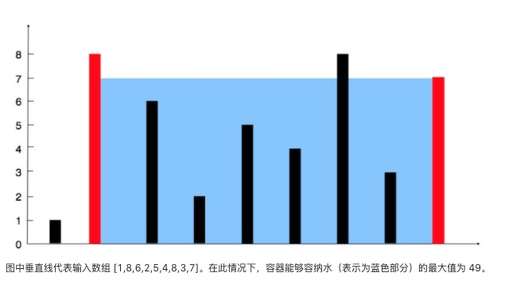

#### 盛最多水的容器

##### 题目

```
给你 n 个非负整数 a1，a2，...，an，每个数代表坐标中的一个点 (i, ai) 。在坐标内画 n 条垂直线，垂直线 i 的两个端点分别为 (i, ai) 和 (i, 0)。找出其中的两条线，使得它们与 x 轴共同构成的容器可以容纳最多的水。

说明：你不能倾斜容器，且 n 的值至少为 2。
```

##### 示例

```
输入：[1,8,6,2,5,4,8,3,7]
输出：49
```



##### 题解

###### 1. 暴力

+ 遍历所有区间，计算哪个区间能够盛最多水！

+ 复杂度

  ```
  时间：O(N^2)
  空间：O(1)
  ```

+ 代码

  ```java
  public int maxArea_1(int[] height) {
    int max = 0;
    for(int i = 0; i < height.length; ++i){
      for(int j = 1; j + i < height.length; ++j){
        int min = Math.min(height[i], height[i + j]);
        max = Math.max(max, min * j);
      }
    }
    return max;
  }
  ```

###### 2. 双指针

+ 前后指针移动，能够找最大的区间

+ 指针移动的规律：

  1. lPoint、rPoint 左右指

  2. 如果 left > right，则 rPoint++

     如果 left <= right，则 lPoint++

  3. 每移动一次，都会统计新边构成的容器的盛水量

+ 指针移动的正确性：

  + 容器遵循短板效应。每次都舍弃短边，能够保留局部上的最大边。

  + 为什么舍弃短边还能够保证最大盛水量呢？

    如果 left < right，只有移动 leftPoint 才有机会消除左边的短板效应，如果移动了 rightPoint，那么将继续保留着左边的 短板，显然上一个状态的短板没有消除，反而全局上可能存在的最优解的 left 被消除！

+ 复杂度

  ```
  时间：O(N)
  空间：O(1)
  ```

+ 代码

  ```java
  public int maxArea(int[] height) {
    int st = 0;
    int end = height.length - 1;
    int max= 0;
    while(st < end){
      int min = Math.min(height[st], height[end]);
      max = Math.max(max, (end - st) * min);
      if(height[st] > height[end]){
        end--;
      }else{
        st++;
      }
    }
    return max;
  }
  ```

  ​


